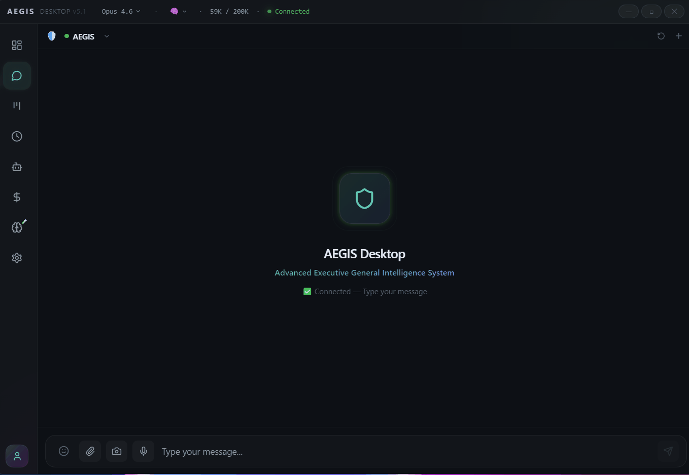
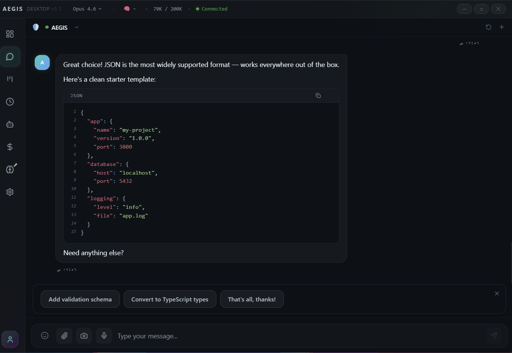
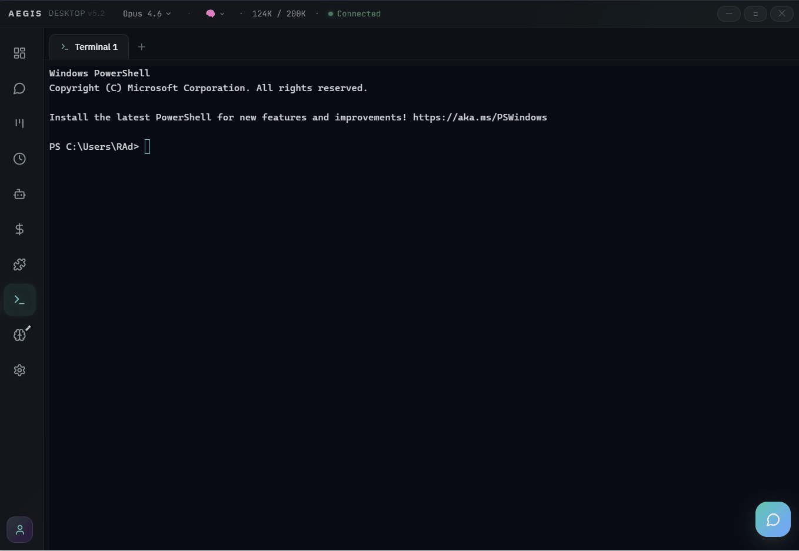

<div align="center">
  
  <h1>OntoSynth Desktop</h1>
  <p><strong>The desktop client that turns your OpenClaw Gateway into a full mission control center.</strong></p>
</div>

---


---

## 🤔 Why OntoSynth Desktop?

OpenClaw is powerful — but managing it through a terminal or basic webchat leaves a lot on the table. OntoSynth Desktop gives it a proper home:

- 💬 **Chat** — streaming responses, artifacts, images, voice, and multi-tab sessions
- 🔘 **Smart Quick Replies** — clickable buttons when the AI needs your decision
- 📊 **Analytics** — see exactly what you're spending and where, broken down by model and agent
- 🤖 **Agent Hub** — manage all your agents from a single panel
- ⏰ **Cron Monitor** — schedule and control jobs visually
- 🔧 **Skills & Terminal** — browse the marketplace and run shell commands without leaving the app
- 🌍 **Bilingual** — full Arabic (RTL) and English (LTR) support out of the box

If you run OpenClaw, OntoSynth Desktop is the UI it deserves.

---

## 📸 Screenshots

### 💬 Chat


### 🔘 Smart Quick Reply Buttons


### 🔧 Skills Marketplace


### 💻 Integrated Terminal


### 🌑 Dark Mode


### 🌕 Light Mode


---

## ✨ Features

### 💬 Chat & Communication
- Streaming markdown with syntax highlighting and theme-aware code blocks
- Multi-tab sessions with `Ctrl+Tab` switching
- Smart Quick Reply Buttons — AI presents clickable `[[button:Label]]` chips
- Image paste/drag/upload, file attachments, video playback, voice messages
- Artifacts preview — interactive HTML, React, SVG, and Mermaid in a sandboxed window
- Message queue with auto-send on reconnect

### 📊 Monitoring & Analytics
- **Dashboard** — cost, tokens, sessions, and active agents at a glance
- **Full Analytics** — date ranges, model/agent/token breakdowns, daily table, CSV export
- **Agent Hub** — create/edit/delete agents, monitor sub-agents and workers
- **Cron Monitor** — schedule, run, pause jobs with run history and templates

### 🔧 Tools
- **Skills Marketplace** — browse and search 3,286+ skills from ClawHub
- **Integrated Terminal** — PowerShell/Bash via xterm.js with multi-tab support
- **Workshop** — Kanban board manageable by AI via text commands
- **Memory Explorer** — semantic search and CRUD for agent memories

### 🎨 Interface
- Dark and light themes with full CSS variable system (`--aegis-*`)
- Arabic (RTL) and English (LTR) with logical CSS properties
- Command Palette (`Ctrl+K`), keyboard shortcuts, global hotkey (`Alt+Space`)
- Model and reasoning level pickers in the title bar
- Glass morphism design with Framer Motion animations
- Ed25519 device identity with challenge-response authentication

---

## 📦 Installation

Download from [Releases](../../releases):

| File | Type |
|------|------|
| `OntoSynth-Desktop-Setup-X.X.X.exe` | Windows installer |
| `OntoSynth-Desktop-X.X.X.exe` | Portable (no install) |
| `OntoSynth-Desktop-X.X.X.dmg` | macOS installer image |
| `OntoSynth-Desktop-X.X.X-mac.zip` | macOS zip build |
| `OntoSynth-Desktop-X.X.X.AppImage` | Linux portable app |
| `OntoSynth-Desktop-X.X.X.deb` | Linux Debian package |
| `OntoSynth-Desktop-X.X.X-linux.tar.gz` | Linux archive |

### Runtime Requirements

- macOS 12+
- Windows 10/11
- Linux x64/arm64 (glibc-based distros recommended)
- [OpenClaw](https://github.com/openclaw/openclaw) Gateway running locally or remotely

On first launch, you'll pair with your Gateway — a one-time setup using Ed25519 device authentication.

### Launch Downloaded Builds

macOS (`.dmg` / `.zip`):
- Drag `OntoSynth Desktop.app` to `Applications`, then open it.
- If Gatekeeper blocks it: `xattr -dr com.apple.quarantine "/Applications/OntoSynth Desktop.app"`

Windows (`Setup.exe` / portable `.exe`):
- Installer: run `OntoSynth-Desktop-Setup-X.X.X.exe`
- Portable: run `OntoSynth-Desktop-X.X.X.exe`

Linux (`.AppImage` / `.deb`):
- AppImage:
  - `chmod +x OntoSynth-Desktop-X.X.X.AppImage`
  - `./OntoSynth-Desktop-X.X.X.AppImage`
- Debian/Ubuntu package:
  - `sudo apt install ./OntoSynth-Desktop-X.X.X.deb`

---

## ▶️ Run From Source (macOS / Windows / Linux)

### 1) Install prerequisites

- Node.js 20 LTS + npm
- Git
- Build tools for `node-pty` (native module):

macOS:
- Xcode Command Line Tools: `xcode-select --install`

Windows:
- Visual Studio Build Tools (Desktop C++ workload)
- Python 3 (used by `node-gyp`)

Linux (Debian/Ubuntu):
- `sudo apt update && sudo apt install -y build-essential python3 make g++`

### 2) Clone and install

```bash
git clone <your-repo-url>
cd openclaw-desktop
npm install
```

If you use `pnpm` instead of `npm`:

```bash
pnpm install
pnpm approve-builds
```

Approve at least: `electron`, `esbuild`, and `node-pty`.

If you switch package managers (npm ↔ pnpm), remove `node_modules` first to avoid broken links.

### 3) Start app in development mode

```bash
npm run dev
```

This launches:
- Vite renderer on `http://localhost:5173`
- Electron desktop shell with hot reload

Browser-only mode (without Electron):

```bash
npm run dev:web
```

---

## 🔌 How It Works

OntoSynth Desktop is a frontend client — it doesn't run AI or store data. Everything lives in your OpenClaw Gateway.

```
OpenClaw Gateway (local or remote)
        │
        │  WebSocket
        ▼
  OntoSynth Desktop
  ├── Chat       ← messages + streaming responses
  ├── Dashboard  ← sessions, cost, agent status
  ├── Analytics  ← cost summary + token history
  ├── Agent Hub  ← registered agents + workers
  ├── Cron       ← scheduled jobs
  ├── Skills     ← ClawHub marketplace
  └── Terminal   ← shell via node-pty
```

---

## 🛠️ Build & Package

```bash
npm install
npm run dev              # Electron + Vite (hot reload)
npm run dev:web          # Browser only (no Electron)
npm run build            # Production build
npm run package          # Alias of package:win
npm run package:win      # Windows NSIS installer
npm run package:portable # Portable exe
npm run package:mac      # macOS dmg + zip
npm run package:linux    # Linux AppImage + deb + tar.gz
npm run package:all      # Build all targets (best on CI/matrix)
```

Output files are generated in `release/`.

Packaging notes:
- Build each OS target on the same OS whenever possible (macOS on macOS, Windows on Windows, Linux on Linux).
- macOS signing/notarization is optional for local testing; use signing identities for production distribution.

---

## 🔧 Tech Stack

| Layer | Technology |
|-------|-----------|
| Framework | Electron 34 |
| UI | React 18 + TypeScript 5.7 |
| Build | Vite 6 |
| Styling | Tailwind CSS + CSS Variables |
| Animations | Framer Motion |
| State | Zustand |
| Charts | Recharts |
| Terminal | xterm.js + node-pty |
| Icons | Lucide React |
| i18n | react-i18next |

---

<details>
<summary><strong>⌨️ Keyboard Shortcuts</strong></summary>

| Shortcut | Action |
|----------|--------|
| `Ctrl+K` | Command Palette |
| `Ctrl+1` – `Ctrl+8` | Navigate pages |
| `Ctrl+,` | Settings |
| `Ctrl+Tab` | Switch chat tabs |
| `Ctrl+W` | Close tab |
| `Ctrl+N` | New chat |
| `Ctrl+R` | Refresh |
| `Alt+Space` | Show/hide window (global) |

</details>

---

## 📚 Documentation

- [Changelog](CHANGELOG.md) — version history and release notes
- [Contributing](CONTRIBUTING.md) — how to contribute
- [Security](SECURITY.md) — vulnerability reporting
- [Code of Conduct](CODE_OF_CONDUCT.md) — community guidelines

---

## 📄 License

[MIT](LICENSE)
